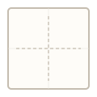
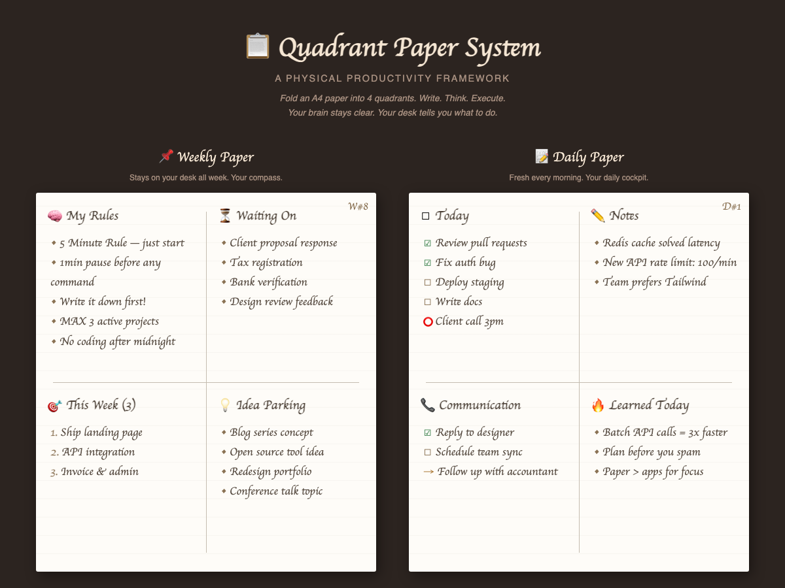

<p align="center">
  
</p>

# Quadrant Paper System

A pen-and-paper planning method: fold an A4 sheet into four quadrants and keep one weekly and one daily page.

[](LICENSE)

Live page: <https://mrsarac.github.io/quadrant-paper-system/>



## Why

Keeping open tasks and half-formed ideas in your head is tiring, and a todo app adds its own overhead (logins, notifications, another window). This method moves everything onto paper that sits on your desk, with a fixed layout so each kind of item has an obvious place.

It came out of the author's own daily use. It is not based on a book or course.

## Quick start

1. Take an A4 sheet and fold it in half twice. That gives four quadrants.
2. Make a **weekly paper** and a **daily paper** using the layouts below.
3. Mark items with the one-stroke marks, and run the two-minute end-of-day ritual.

Printable guides are in this repo. Open one in a browser and print it on A4 (`Ctrl+P` / `Cmd+P`):

- `templates/print-weekly.html` — weekly paper
- `templates/print-daily.html` — daily paper

`index.html` is the visual overview shown in the screenshot; open it locally or use the live page. All three files are plain HTML with no build step (they load the Caveat font from Google Fonts).

## How it works

### Weekly paper

Stays on your desk all week. Rewrite it every Monday.

```
+---------------------------+---------------------------+
| MY RULES                  | WAITING ON                |
|                           |                           |
| - 5 minute rule           | - Client proposal         |
| - Pause before acting     | - Tax registration        |
| - Write it down first     | - Bank verification       |
| - Max 3 active projects   | - Design feedback         |
+---------------------------+---------------------------+
| THIS WEEK (3)             | IDEA PARKING              |
|                           |                           |
| 1. Ship landing page      | - Blog series concept     |
| 2. API integration        | - Open source tool        |
| 3. Invoice & admin        | - Redesign portfolio      |
+---------------------------+---------------------------+
```

| Quadrant | What goes here | Why |
|:---------|:---------------|:----|
| **My Rules** | Personal principles, habits | Keeps your standards visible |
| **Waiting On** | Blocked items, other people's tasks | You can stop tracking them in your head |
| **This Week (3)** | At most 3 priorities | Forces a choice |
| **Idea Parking** | Future ideas, not-now items | Captured without becoming today's work |

### Daily paper

A fresh sheet every morning.

```
+---------------------------+---------------------------+
| TODAY                     | NOTES                     |
|                           |                           |
| [x] Review pull requests  | - Redis fixed latency     |
| [x] Fix auth bug          | - Team prefers Tailwind   |
| [ ] Deploy staging        |                           |
| (!) Client call 3pm       |                           |
+---------------------------+---------------------------+
| COMMUNICATION             | LEARNED TODAY             |
|                           |                           |
| [x] Reply to designer     | - Batch similar calls     |
| [ ] Schedule team sync    | - Plan before you start   |
| ->  Follow up accountant  |                           |
+---------------------------+---------------------------+
```

| Quadrant | What goes here | Why |
|:---------|:---------------|:----|
| **Today** | Tasks with checkboxes | Done or not, nothing in between |
| **Notes** | Observations, context, data | Capture without switching tools |
| **Communication** | People to reach, replies owed | Calls and messages get their own list |
| **Learned Today** | Insights, lessons | Easy to review at the end of the week |

### Marks

One stroke changes an item's status:

```
☐   To do
☑   Done
→   Carry to tomorrow
✕   Cancelled
⭕  Urgent, do first
•   Note (information, not an action)
```

### Corner tag

Write a date and sheet tag in the corner so a stack of pages stays sortable:

```
23.02 W#8     weekly paper, week 8
23.02 D#1     daily paper, day 1
```

### End-of-day ritual

About two minutes:

1. Look at the paper.
2. Mark finished items ☑.
3. Mark unfinished items → so they move to tomorrow.
4. Take a photo of the page for your archive.
5. Start tomorrow with a fresh sheet.

The paper is the tool; the photo is the backup and makes old pages searchable.

### Habits that go with it

- **Max 3.** Never more than three items in "This Week". Park the rest.
- **5-minute rule.** If you are avoiding a task, commit to five minutes of it.
- **1-minute pause.** Before sending a message or running a command, stop for a minute and think.
- **Keep it messy.** Arrows, circles and scribbles are fine. It is a thinking tool, not a presentation.
- **Monday rewrite.** Rewrite the weekly paper from memory rather than copying last week's.

### Adapting the labels

The quadrant labels are suggestions. The system is the four quadrants plus the daily ritual. Examples:

| Who | Quadrants |
|:----|:----------|
| Students | Study tasks · Deadlines · Ask the professor · Key concepts |
| Managers | Team tasks · Blockers · Metrics · Strategy |
| Creators | Create · Publish · Research · Business |

The layout borrows the 2x2 shape of the Eisenhower matrix, but the quadrants are not urgent/important buckets. They separate kinds of thinking: rules, waiting, focus and ideas.

### Paper vs. apps

| | Paper | App |
|:--|:--|:--|
| Start-up | Pick up the pen | Open, log in, navigate |
| Notifications | None | Usually some |
| Visibility | On the desk | In a window or tab |
| Cost | A sheet of paper | Often a subscription |
| Setup | Fold the sheet | Account, configuration, sync |

Related research, for context rather than proof that this method works:

- Mueller & Oppenheimer (2014) found students taking notes by hand did better on conceptual questions than laptop note-takers ([doi:10.1177/0956797614524581](https://doi.org/10.1177/0956797614524581)). Later replications have been mixed.
- Umejima et al. (2021) reported higher brain activation during recall for people who had written in a paper notebook versus on mobile devices ([doi:10.3389/fnbeh.2021.634158](https://doi.org/10.3389/fnbeh.2021.634158)).
- The Zeigarnik effect describes unfinished tasks staying more present in memory; writing a task down is a common way to set it aside.

## Status / limits

- This is a personal method shared as-is. It has not been studied or measured.
- The repo contains static HTML only: `index.html`, two print templates and assets. There is no app, sync or data storage.
- The print templates are tuned for A4; other paper sizes are untested.
- There are no PDF versions of the templates; print the HTML files instead.

## Contributing

Found a better quadrant layout or adapted it for your work? Open an issue or a pull request.

## License

[MIT](LICENSE) © 2026 Mustafa Saraç
